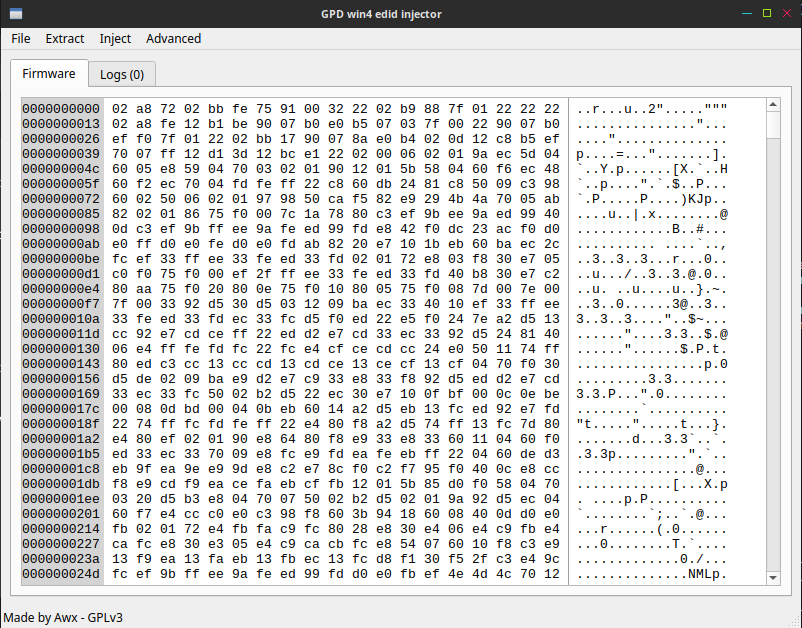

# GPD-Win4-edid-injector

Inject custom edid in screen firmware for permanet modifications instead of cru usage

can also extract both firmware and edid from .hex firmware file

available for both windows and linux

